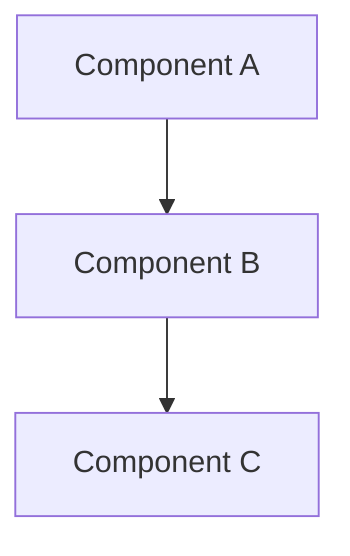
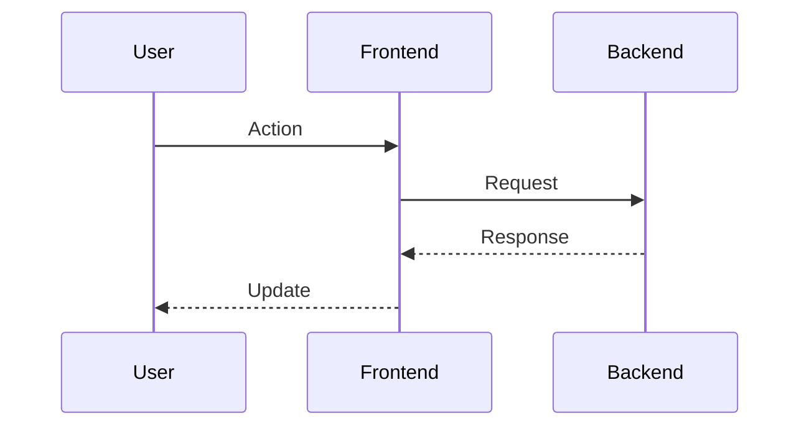

# Technical Design: {{FEATURE_NAME}}

## Overview
Brief summary of the technical approach and architecture pattern chosen.

## Architecture Pattern & Boundary Map

### Selected Pattern
Describe the overall architecture pattern (e.g., Client-Server, MVC, Microservices, Layered).

**Rationale**: Explain why this pattern was chosen based on requirements and constraints.

### System Boundaries
Define the boundaries of the system and its components using a Mermaid diagram.



**Boundary Definitions**:
- **External Boundaries**: Interfaces with external systems, users, APIs
- **Internal Boundaries**: Separation between layers, modules, services

### Requirements Coverage
Map architecture components to requirements:
- **Requirement 1**: Addressed by [Component Names]
- **Requirement 2**: Addressed by [Component Names]

## Technology Stack & Alignment

### Selected Technologies

| Layer | Technology | Version | Rationale |
|-------|-----------|---------|-----------|
| Frontend | [Tech] | [Version] | [Why chosen] |
| Backend | [Tech] | [Version] | [Why chosen] |
| Communication | [Tech] | [Version] | [Why chosen] |
| Storage | [Tech] | [Version] | [Why chosen] |

### Dependency Verification
- **External APIs**: [List verified APIs, endpoints, rate limits]
- **Libraries**: [List key libraries with compatibility notes]
- **Compatibility**: [Document compatibility between technologies]

### Alignment with Steering
- **Existing Patterns**: [Reference steering context alignment]
- **Deviations**: [Document any deviations from project standards with rationale]

## Components & Interface Contracts

### Component 1: [Component Name]

**Purpose**: Brief description of component role.

**Responsibilities**:
- Responsibility 1
- Responsibility 2

**Interface**:

```typescript
// Define interface with strong types
interface ComponentInterface {
  method1(param: Type): ReturnType;
  method2(param: Type): Promise<ReturnType>;
}
```

**Data Structures**:

```typescript
type DataStructure = {
  field1: Type;
  field2: Type;
};
```

**Requirements Addressed**: [Requirement IDs]

---

### Component 2: [Component Name]

**Purpose**: Brief description of component role.

**Responsibilities**:
- Responsibility 1
- Responsibility 2

**Interface**:

```typescript
// Define interface with strong types
interface ComponentInterface {
  method1(param: Type): ReturnType;
}
```

**Requirements Addressed**: [Requirement IDs]

## Data Flow & State Management

### Data Flow Diagram



### State Management
- **State Location**: Where state is stored (client/server/shared)
- **State Transitions**: Key state changes and triggers
- **State Persistence**: How state is persisted (if applicable)

## API Contracts

### Endpoint 1: [Name]

**Method**: `POST /endpoint`

**Request**:
```typescript
type Request = {
  field: Type;
};
```

**Response**:
```typescript
type Response = {
  field: Type;
};
```

**Error Handling**:
- `400`: Invalid request format
- `500`: Server error

**Requirements Addressed**: [Requirement IDs]

---

### Endpoint 2: [Name]

**Method**: `GET /endpoint`

**Response**:
```typescript
type Response = {
  items: Array<Type>;
};
```

**Requirements Addressed**: [Requirement IDs]

## Non-Functional Requirements Design

### Performance
- **Response Time**: [Target and design approach]
- **Throughput**: [Capacity design]
- **Resource Usage**: [Memory, CPU, bandwidth considerations]

### Security
- **Authentication**: [Design approach]
- **Authorization**: [Access control design]
- **Data Protection**: [Encryption, sanitization]

### Scalability
- **Horizontal Scaling**: [Design approach]
- **Load Distribution**: [Strategy]
- **Bottlenecks**: [Identified and mitigation]

### Reliability
- **Error Handling**: [Strategy across components]
- **Retry Logic**: [Where and how]
- **Graceful Degradation**: [Fallback mechanisms]

## Risk Analysis

### Risk 1: [Risk Name]
**Description**: What could go wrong
**Impact**: High/Medium/Low
**Mitigation**: How design addresses this risk
**Requirements Impacted**: [Requirement IDs]

### Risk 2: [Risk Name]
**Description**: What could go wrong
**Impact**: High/Medium/Low
**Mitigation**: How design addresses this risk
**Requirements Impacted**: [Requirement IDs]

## Implementation Considerations

### Development Approach
- **Build Order**: Suggested sequence of component development
- **Critical Path**: Components that must be completed first
- **Parallel Work**: Components that can be developed independently

### Testing Strategy
- **Unit Testing**: Key interfaces to test
- **Integration Testing**: Critical integration points
- **End-to-End Testing**: User scenarios to validate

### Deployment Considerations
- **Environment Setup**: Required infrastructure
- **Configuration**: Key configuration parameters
- **Dependencies**: External dependencies and setup

---

*Generated: {{TIMESTAMP}}*

## Generation Instructions (Remove before final output)

This template provides structure for technical design documents. When generating:

1. **Replace all {{PLACEHOLDERS}}** with actual content
2. **Remove this Generation Instructions section** from final output
3. **Use strong typing** in all interface definitions (no `any` types for TypeScript)
4. **Include Mermaid diagrams** for complex relationships
5. **Map all requirements** to components/APIs explicitly
6. **Document rationale** for technology and architecture choices
7. **Reference research.md** for detailed investigation findings
8. **Use numeric requirement IDs** (e.g., "Requirement 1", "Requirement 2") matching requirements.md
9. **Use the language specified in spec.json** for all content
