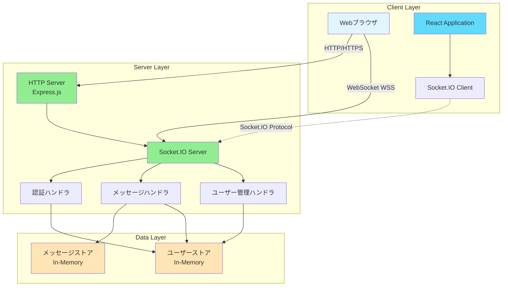
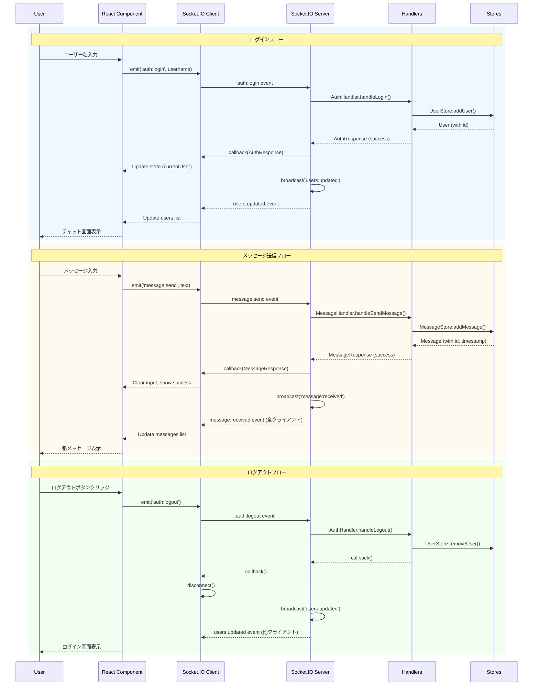
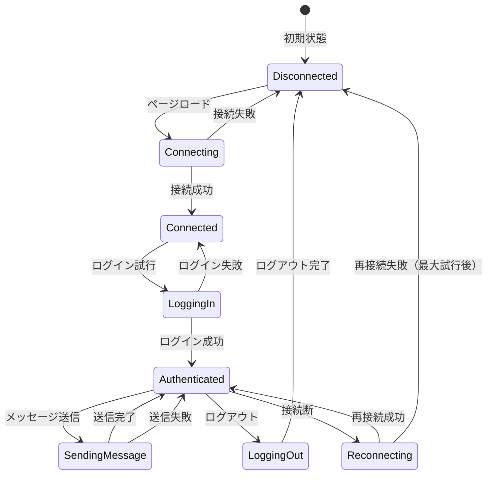

# Technical Design: simple-chat

## Overview
シンプルなチャットアプリケーションは、**Client-Server + Event-Driven (Pub/Sub)アーキテクチャ**を採用し、Socket.IOを用いたリアルタイム双方向通信を実現する。フロントエンドはReact + TypeScript、バックエンドはExpress.js + TypeScriptで構築し、型安全性と保守性を重視した設計とする。

## Architecture Pattern & Boundary Map

### Selected Pattern
**Client-Server + Event-Driven (Pub/Sub) Architecture**

**Rationale**:
- リアルタイム性が最優先要件（1秒以内のメッセージ配信）
- Socket.IOのRoom機能とBroadcastingが要件（全ユーザーへの即時配信、ユーザー一覧更新）と完全一致
- シンプルで保守しやすい構造（10同時接続要件に対して十分）
- 将来的にRedis Adapterを追加することで水平スケーリング可能

### System Boundaries



**Boundary Definitions**:

**External Boundaries**:
- **User ↔ Browser**: ユーザーインタラクション（入力、表示）
- **Browser ↔ Server**:
  - HTTP/HTTPS: 静的ファイル配信、初回ロード
  - WebSocket (WSS): リアルタイム双方向通信（Socket.IO Protocol over Engine.IO）

**Internal Boundaries**:
- **Presentation Layer (React) ↔ Transport Layer (Socket.IO Client)**: Custom React hooks経由
- **Transport Layer (Socket.IO Server) ↔ Business Logic (Handlers)**: イベント駆動型ハンドラ
- **Business Logic ↔ Data Layer (Stores)**: Repository pattern interface

### Requirements Coverage

| 要件 | 対応コンポーネント |
|------|------------------|
| **要件 1: ユーザー認証** | AuthHandler, UserStore, React Login Component |
| **要件 2: メッセージ送信** | MessageHandler, MessageStore, Socket.IO Client/Server, React Message Input |
| **要件 3: メッセージ受信と表示** | MessageHandler, MessageStore, Socket.IO Broadcasting, React Message List |
| **要件 4: ユーザー一覧表示** | UserHandler, UserStore, Socket.IO Broadcasting, React User List |
| **要件 5: ログアウト** | AuthHandler, UserStore, Socket.IO disconnect, React Logout Button |
| **非機能要件 - パフォーマンス** | Socket.IO (低レイテンシ), In-Memory Store (高速アクセス) |
| **非機能要件 - セキュリティ** | express-validator (入力検証), helmet (CSP), React (自動エスケープ) |
| **非機能要件 - ユーザビリティ** | React (レスポンシブ), Enter key handler, Loading states |
| **非機能要件 - 可用性** | Socket.IO (自動再接続), Error handling, Acknowledgements |

## Technology Stack & Alignment

### Selected Technologies

| Layer | Technology | Version | Rationale |
|-------|-----------|---------|-----------|
| **Frontend** | React | 18.x | 成熟したUIライブラリ、Concurrent Mode、豊富なエコシステム |
| | TypeScript | 5.x | 型安全性、開発体験向上、バグ早期発見 |
| | Socket.IO Client | 4.x | サーバーとの双方向通信、自動再接続、イベントベースAPI |
| **Backend** | Node.js | 20.x LTS | 非同期I/O、WebSocket対応、JavaScriptエコシステム |
| | Express.js | 4.x/5.x | 成熟したWebフレームワーク、ミドルウェアエコシステム、Socket.IO統合が標準的 |
| | TypeScript | 5.x | 型安全性、バックエンドロジックの堅牢性向上 |
| **Communication** | Socket.IO | 4.x | 自動再接続、Room/Broadcasting、Acknowledgements、HTTP Long-Polling fallback |
| **Storage** | In-Memory | N/A | 永続化スコープ外、最新100件保持、高速アクセス |
| **Security** | express-validator | 7.x | 入力バリデーションとサニタイゼーション |
| | helmet | 7.x | セキュリティヘッダー設定、CSP実装 |
| **Build Tools** | Vite | 5.x | 高速ビルド、HMR、TypeScript統合 |

### Dependency Verification

**External APIs/Libraries**:
- **Socket.IO v4.x**:
  - 最新安定版（~4.7.x）
  - Breaking changes: なし（v4系内で互換性維持）
  - クライアント/サーバー間バージョン互換性必須
  - バンドルサイズ: 10.4 KB (minified + gzipped)

- **Express.js v4.x/5.x**:
  - Socket.IOは`http.Server`インスタンスが必要（Express appをラップ）
  - 互換性: 問題なし

- **express-validator v7.x**:
  - Express.js v4.x/5.xと互換
  - サニタイゼーションと検証の統合API

- **helmet v7.x**:
  - Express.js互換
  - CSP、X-Frame-Optionsなどのセキュリティヘッダー設定

**Compatibility Matrix**:
- React 18 + TypeScript 5: ✅ 完全互換
- Node.js 20 LTS + TypeScript 5: ✅ 完全互換
- Socket.IO v4 Client/Server: ✅ 同バージョン推奨
- Express.js 4.x + Socket.IO 4.x: ✅ 標準的な統合パターン

### Alignment with Steering

**注意**: Steering contextが空のため、プロジェクト全体の既存パターンとの整合性は未確認。以下は一般的なベストプラクティスに基づく。

**採用した標準パターン**:
- TypeScript強制による型安全性
- Layered Architecture（Presentation、Business Logic、Data Layer分離）
- Repository Pattern（Data Layer抽象化）
- Event-Driven Architecture（Socket.IOイベントベース）

**Deviations**:
- なし（新規プロジェクトのため既存パターンからの逸脱なし）

## Components & Interface Contracts

### Component 1: Socket.IO Server

**Purpose**: クライアントとサーバー間のリアルタイム双方向通信を管理

**Responsibilities**:
- WebSocket接続の確立と管理
- イベントベースのメッセージルーティング
- Broadcasting（全クライアントまたはRoom単位）
- 自動再接続と接続状態管理

**Interface**:

```typescript
import { Server as SocketIOServer, Socket } from 'socket.io';
import { Server as HTTPServer } from 'http';

interface ServerToClientEvents {
  // メッセージ受信
  'message:received': (message: Message) => void;

  // ユーザー一覧更新
  'users:updated': (users: User[]) => void;

  // エラー通知
  'error': (error: ErrorResponse) => void;
}

interface ClientToServerEvents {
  // ログイン
  'auth:login': (username: string, callback: (response: AuthResponse) => void) => void;

  // メッセージ送信
  'message:send': (messageText: string, callback: (response: MessageResponse) => void) => void;

  // ログアウト
  'auth:logout': (callback: () => void) => void;
}

interface InterServerEvents {
  // 将来的なRedis Adapter用（複数サーバー間通信）
}

interface SocketData {
  userId: string;
  username: string;
}

type TypedSocket = Socket<ClientToServerEvents, ServerToClientEvents, InterServerEvents, SocketData>;
type TypedServer = SocketIOServer<ClientToServerEvents, ServerToClientEvents, InterServerEvents, SocketData>;

// 初期化関数
function initializeSocketIO(httpServer: HTTPServer): TypedServer;
```

**Data Structures**:

```typescript
interface Message {
  id: string;
  username: string;
  text: string;
  timestamp: number; // Unix timestamp (ms)
}

interface User {
  id: string;
  username: string;
  connectedAt: number;
}

interface AuthResponse {
  success: boolean;
  userId?: string;
  error?: string;
}

interface MessageResponse {
  success: boolean;
  messageId?: string;
  error?: string;
}

interface ErrorResponse {
  code: string;
  message: string;
}
```

**Requirements Addressed**: 要件 1, 2, 3, 4, 5（全要件のリアルタイム通信基盤）

---

### Component 2: AuthHandler

**Purpose**: ユーザー認証（ログイン/ログアウト）の処理

**Responsibilities**:
- ユーザー名のバリデーション
- ユーザー登録と重複チェック
- ログアウト処理とクリーンアップ
- ユーザー一覧の更新通知

**Interface**:

```typescript
interface AuthHandler {
  /**
   * ユーザーログイン処理
   * @param socket - クライアントソケット
   * @param username - ユーザー名（1-20文字、英数字のみ）
   * @returns AuthResponse with userId or error
   */
  handleLogin(socket: TypedSocket, username: string): Promise<AuthResponse>;

  /**
   * ユーザーログアウト処理
   * @param socket - クライアントソケット
   */
  handleLogout(socket: TypedSocket): Promise<void>;

  /**
   * 切断処理（予期しない切断含む）
   * @param socket - クライアントソケット
   */
  handleDisconnect(socket: TypedSocket): Promise<void>;
}

// バリデーションルール
interface UsernameValidation {
  minLength: 1;
  maxLength: 20;
  pattern: /^[a-zA-Z0-9_]+$/; // 英数字とアンダースコアのみ
}
```

**Requirements Addressed**: 要件 1（ユーザー認証）、要件 5（ログアウト）

---

### Component 3: MessageHandler

**Purpose**: メッセージの送受信とブロードキャスト処理

**Responsibilities**:
- メッセージのバリデーションとサニタイゼーション
- メッセージ保存（最新100件）
- 全クライアントへのブロードキャスト
- メッセージ履歴の提供

**Interface**:

```typescript
interface MessageHandler {
  /**
   * メッセージ送信処理
   * @param socket - 送信者のソケット
   * @param messageText - メッセージ本文（1-500文字）
   * @returns MessageResponse with messageId or error
   */
  handleSendMessage(socket: TypedSocket, messageText: string): Promise<MessageResponse>;

  /**
   * メッセージ履歴取得
   * @param limit - 取得件数（デフォルト: 100）
   * @returns Message配列（時系列順）
   */
  getMessageHistory(limit?: number): Promise<Message[]>;
}

// バリデーションルール
interface MessageValidation {
  minLength: 1;
  maxLength: 500;
  sanitizeHTML: true; // HTMLタグ除去
  trimWhitespace: true;
}
```

**Data Flow**:
1. クライアントが`message:send`イベント発行
2. `MessageHandler.handleSendMessage()`がバリデーション実行
3. タイムスタンプと送信者情報を付与してメッセージ作成
4. `MessageStore`に保存
5. Socket.IO Server経由で全クライアントに`message:received`イベントでブロードキャスト
6. Acknowledgement callbackで送信者に成功/失敗を返却

**Requirements Addressed**: 要件 2（メッセージ送信）、要件 3（メッセージ受信と表示）

---

### Component 4: UserHandler

**Purpose**: オンラインユーザーの管理と一覧提供

**Responsibilities**:
- オンラインユーザー一覧の管理
- ユーザー追加/削除時の全クライアントへの通知
- 現在のユーザー数カウント

**Interface**:

```typescript
interface UserHandler {
  /**
   * オンラインユーザー一覧取得
   * @returns User配列（接続順）
   */
  getOnlineUsers(): Promise<User[]>;

  /**
   * ユーザー追加通知（ログイン時）
   * @param user - 追加されたユーザー
   */
  notifyUserJoined(user: User): Promise<void>;

  /**
   * ユーザー削除通知（ログアウト/切断時）
   * @param userId - 削除されたユーザーID
   */
  notifyUserLeft(userId: string): Promise<void>;

  /**
   * 現在のオンラインユーザー数取得
   * @returns ユーザー数
   */
  getOnlineUserCount(): number;
}
```

**Requirements Addressed**: 要件 4（ユーザー一覧表示）

---

### Component 5: MessageStore

**Purpose**: メッセージデータの保存と取得（In-Memory）

**Responsibilities**:
- 最新100件のメッセージ保持
- メッセージの追加と取得
- 古いメッセージの自動削除（100件超過時）

**Interface**:

```typescript
interface MessageStore {
  /**
   * メッセージ追加
   * @param message - 追加するメッセージ
   * @returns 追加されたメッセージ（IDとtimestamp付与済み）
   */
  addMessage(message: Omit<Message, 'id' | 'timestamp'>): Promise<Message>;

  /**
   * メッセージ履歴取得
   * @param limit - 取得件数（デフォルト: 100、最大: 100）
   * @returns Message配列（時系列順、最新が末尾）
   */
  getMessages(limit?: number): Promise<Message[]>;

  /**
   * 保存メッセージ数取得
   * @returns 現在のメッセージ数
   */
  getMessageCount(): number;

  /**
   * 全メッセージクリア（テスト用）
   */
  clear(): void;
}

// 実装例（In-Memory）
class InMemoryMessageStore implements MessageStore {
  private messages: Message[] = [];
  private readonly MAX_MESSAGES = 100;

  async addMessage(message: Omit<Message, 'id' | 'timestamp'>): Promise<Message> {
    const newMessage: Message = {
      ...message,
      id: generateId(),
      timestamp: Date.now()
    };

    this.messages.push(newMessage);

    // 100件超過時、古いメッセージ削除
    if (this.messages.length > this.MAX_MESSAGES) {
      this.messages.shift();
    }

    return newMessage;
  }

  // 他のメソッド実装...
}
```

**Requirements Addressed**: 要件 2, 3（メッセージ保存と履歴提供）、非機能要件 - パフォーマンス（最新100件保持）

---

### Component 6: UserStore

**Purpose**: ユーザーデータの保存と取得（In-Memory）

**Responsibilities**:
- オンラインユーザーの保持
- ユーザー名重複チェック
- ユーザー追加/削除/検索

**Interface**:

```typescript
interface UserStore {
  /**
   * ユーザー追加
   * @param user - 追加するユーザー
   * @returns 追加されたユーザー
   * @throws ユーザー名が既に存在する場合エラー
   */
  addUser(user: Omit<User, 'id' | 'connectedAt'>): Promise<User>;

  /**
   * ユーザー削除
   * @param userId - 削除するユーザーID
   * @returns 削除されたユーザー、存在しない場合undefined
   */
  removeUser(userId: string): Promise<User | undefined>;

  /**
   * ユーザーID検索
   * @param userId - 検索するユーザーID
   * @returns ユーザー、存在しない場合undefined
   */
  getUserById(userId: string): Promise<User | undefined>;

  /**
   * ユーザー名検索
   * @param username - 検索するユーザー名
   * @returns ユーザー、存在しない場合undefined
   */
  getUserByUsername(username: string): Promise<User | undefined>;

  /**
   * 全ユーザー取得
   * @returns User配列（接続順）
   */
  getAllUsers(): Promise<User[]>;

  /**
   * オンラインユーザー数取得
   * @returns ユーザー数
   */
  getUserCount(): number;

  /**
   * 全ユーザークリア（テスト用）
   */
  clear(): void;
}
```

**Requirements Addressed**: 要件 1, 4, 5（ユーザー管理全般）

---

### Component 7: React Application

**Purpose**: ユーザーインターフェースの提供

**Responsibilities**:
- ログイン画面の表示
- チャット画面の表示（メッセージ一覧、入力フォーム、ユーザー一覧）
- Socket.IOクライアントとの統合
- ローカル状態管理（React hooks）

**Interface**:

```typescript
// Custom Hook: useSocket
interface UseSocketReturn {
  // 接続状態
  isConnected: boolean;

  // ログイン
  login: (username: string) => Promise<AuthResponse>;

  // ログアウト
  logout: () => Promise<void>;

  // メッセージ送信
  sendMessage: (text: string) => Promise<MessageResponse>;

  // メッセージ履歴（リアルタイム更新）
  messages: Message[];

  // オンラインユーザー一覧（リアルタイム更新）
  users: User[];

  // エラー状態
  error: ErrorResponse | null;
}

function useSocket(): UseSocketReturn;
```

**Component Structure**:

```typescript
// App.tsx - ルートコンポーネント
interface AppProps {}
function App(): JSX.Element;

// LoginPage.tsx - ログイン画面
interface LoginPageProps {
  onLogin: (username: string) => Promise<void>;
}
function LoginPage(props: LoginPageProps): JSX.Element;

// ChatPage.tsx - チャット画面
interface ChatPageProps {
  currentUser: User;
  messages: Message[];
  users: User[];
  onSendMessage: (text: string) => Promise<void>;
  onLogout: () => Promise<void>;
}
function ChatPage(props: ChatPageProps): JSX.Element;

// MessageList.tsx - メッセージ一覧
interface MessageListProps {
  messages: Message[];
  currentUserId: string;
}
function MessageList(props: MessageListProps): JSX.Element;

// MessageInput.tsx - メッセージ入力フォーム
interface MessageInputProps {
  onSend: (text: string) => Promise<void>;
  disabled: boolean;
}
function MessageInput(props: MessageInputProps): JSX.Element;

// UserList.tsx - ユーザー一覧
interface UserListProps {
  users: User[];
  currentUserId: string;
}
function UserList(props: UserListProps): JSX.Element;
```

**State Management**:
- **ローカル状態** (`useState`): 入力フォームテキスト、送信中状態
- **Context API**: 現在のユーザー情報（`currentUser`）
- **Custom Hook** (`useSocket`): Socket.IO統合、メッセージ/ユーザー一覧のリアルタイム更新

**Requirements Addressed**: 要件 1, 2, 3, 4, 5（全UIコンポーネント）

## Data Flow & State Management

### Data Flow Diagram



### State Management

**クライアント側状態管理**:

| 状態の種類 | 管理方法 | 更新頻度 | 理由 |
|-----------|---------|---------|------|
| **メッセージ一覧** | `useState` (useSocket hook内) | 高（メッセージ送信時） | Socket.IOイベントでリアルタイム更新 |
| **ユーザー一覧** | `useState` (useSocket hook内) | 中（ログイン/ログアウト時） | Socket.IOイベントでリアルタイム更新 |
| **現在のユーザー** | Context API | 低（ログイン時のみ） | 複数コンポーネントで参照、低頻度更新 |
| **入力フォームテキスト** | `useState` (MessageInput内) | 高（キー入力毎） | ローカル状態、他コンポーネントに影響なし |
| **送信中状態** | `useState` (MessageInput内) | 低（送信開始/完了時） | ボタン無効化、スピナー表示 |
| **接続状態** | `useState` (useSocket hook内) | 低（接続/切断時） | エラーメッセージ表示 |
| **エラー状態** | `useState` (useSocket hook内) | 低（エラー発生時） | エラーメッセージ表示 |

**サーバー側状態管理**:

| 状態の種類 | 管理方法 | 永続性 | スコープ |
|-----------|---------|-------|---------|
| **メッセージ履歴** | MessageStore (In-Memory) | 揮発性 | 最新100件 |
| **オンラインユーザー** | UserStore (In-Memory) | 揮発性 | 全オンラインユーザー |
| **Socket接続** | Socket.IO Server | 揮発性 | アクティブ接続のみ |

**State Transitions**:



**State Persistence**:
- **クライアント**: なし（ページリロード時に全状態リセット）
- **サーバー**: メモリ上のみ（サーバー再起動時に全状態リセット）
- **制約事項**: 要件で永続化はスコープ外と明記

## API Contracts

### Socket.IO Event Contracts

#### Event 1: auth:login

**Direction**: Client → Server

**Request**:
```typescript
socket.emit('auth:login', username: string, callback: (response: AuthResponse) => void);
```

**Request Data**:
```typescript
// username: string
// - 長さ: 1-20文字
// - パターン: /^[a-zA-Z0-9_]+$/ (英数字とアンダースコアのみ)
```

**Response** (via callback):
```typescript
interface AuthResponse {
  success: boolean;
  userId?: string; // 成功時のみ
  error?: string; // 失敗時のみ
}

// 成功例
{
  success: true,
  userId: "uuid-v4-string"
}

// 失敗例
{
  success: false,
  error: "Username already taken"
}
```

**Error Handling**:
- `400 Bad Request`: ユーザー名が空、または不正な文字
- `409 Conflict`: ユーザー名が既に使用中
- `500 Internal Server Error`: サーバー内部エラー

**Side Effects**:
- 成功時: UserStoreにユーザー追加、全クライアントに`users:updated`イベントブロードキャスト

**Requirements Addressed**: 要件 1（ユーザー認証）

---

#### Event 2: message:send

**Direction**: Client → Server

**Request**:
```typescript
socket.emit('message:send', messageText: string, callback: (response: MessageResponse) => void);
```

**Request Data**:
```typescript
// messageText: string
// - 長さ: 1-500文字
// - サニタイゼーション: HTMLタグ除去、trim
```

**Response** (via callback):
```typescript
interface MessageResponse {
  success: boolean;
  messageId?: string; // 成功時のみ
  error?: string; // 失敗時のみ
}

// 成功例
{
  success: true,
  messageId: "uuid-v4-string"
}

// 失敗例
{
  success: false,
  error: "Message text is required"
}
```

**Error Handling**:
- `400 Bad Request`: メッセージが空、または500文字超過
- `401 Unauthorized`: 未ログイン状態
- `500 Internal Server Error`: サーバー内部エラー

**Side Effects**:
- 成功時: MessageStoreにメッセージ追加、全クライアントに`message:received`イベントブロードキャスト

**Requirements Addressed**: 要件 2（メッセージ送信）

---

#### Event 3: message:received

**Direction**: Server → Client (Broadcast)

**Event Data**:
```typescript
interface Message {
  id: string; // UUID v4
  username: string; // 送信者名
  text: string; // メッセージ本文（サニタイズ済み）
  timestamp: number; // Unix timestamp (ms)
}

// 例
{
  id: "550e8400-e29b-41d4-a716-446655440000",
  username: "user123",
  text: "Hello, world!",
  timestamp: 1704067200000
}
```

**Trigger**: 誰かがメッセージを送信したとき

**Broadcast Scope**: 全接続中クライアント

**Requirements Addressed**: 要件 3（メッセージ受信と表示）

---

#### Event 4: users:updated

**Direction**: Server → Client (Broadcast)

**Event Data**:
```typescript
interface User {
  id: string; // UUID v4
  username: string;
  connectedAt: number; // Unix timestamp (ms)
}

// ユーザー配列
type UsersUpdatePayload = User[];

// 例
[
  {
    id: "550e8400-e29b-41d4-a716-446655440000",
    username: "user123",
    connectedAt: 1704067200000
  },
  {
    id: "660e8400-e29b-41d4-a716-446655440001",
    username: "user456",
    connectedAt: 1704067300000
  }
]
```

**Trigger**: ユーザーがログイン、ログアウト、または切断したとき

**Broadcast Scope**: 全接続中クライアント

**Requirements Addressed**: 要件 4（ユーザー一覧表示）

---

#### Event 5: auth:logout

**Direction**: Client → Server

**Request**:
```typescript
socket.emit('auth:logout', callback: () => void);
```

**Response** (via callback):
```typescript
// callback関数が呼ばれる（引数なし）
```

**Side Effects**:
- UserStoreからユーザー削除
- Socket接続切断
- 全クライアントに`users:updated`イベントブロードキャスト

**Requirements Addressed**: 要件 5（ログアウト）

---

#### Event 6: error

**Direction**: Server → Client

**Event Data**:
```typescript
interface ErrorResponse {
  code: string; // エラーコード（例: 'AUTH_FAILED', 'MESSAGE_INVALID'）
  message: string; // ユーザー向けエラーメッセージ
}

// 例
{
  code: "AUTH_FAILED",
  message: "Username is already taken"
}
```

**Trigger**: サーバー側でエラーが発生したとき

**Broadcast Scope**: エラーが発生したクライアントのみ

**Requirements Addressed**: 非機能要件 - 可用性（エラーメッセージ表示）

---

#### Event 7: disconnect

**Direction**: Client → Server (自動)

**Trigger**: クライアントが切断したとき（ブラウザクローズ、ネットワーク切断、ログアウト）

**Side Effects**:
- `AuthHandler.handleDisconnect()`呼び出し
- UserStoreからユーザー削除
- 全クライアントに`users:updated`イベントブロードキャスト

**Requirements Addressed**: 要件 4, 5（ユーザー一覧更新、切断処理）

---

#### Event 8: connect / reconnect (自動)

**Direction**: Client ↔ Server (Socket.IO自動処理)

**Trigger**:
- `connect`: 初回接続時
- `reconnect`: 切断後の再接続成功時

**Side Effects**:
- クライアント側で`isConnected`状態更新
- 再接続後、メッセージ履歴とユーザー一覧を再取得

**Requirements Addressed**: 非機能要件 - 可用性（自動再接続）

## Non-Functional Requirements Design

### Performance

**Response Time**:
- **目標**: 新しいメッセージを1秒以内に全クライアントに配信
- **設計アプローチ**:
  - Socket.IOのWebSocket transportによる低レイテンシ通信（typically < 100ms）
  - In-Memory Storeによる高速データアクセス（O(1)追加、O(n)取得、n≤100）
  - Broadcasting: Socket.IO Server → 全接続クライアント（並列配信）
- **測定方法**: メッセージ送信時刻とクライアント受信時刻の差を計測

**Throughput**:
- **目標**: 同時に最低10ユーザーの接続を処理
- **設計アプローチ**:
  - Node.jsの非同期I/Oによる効率的な接続管理
  - Socket.IO Serverは数千の同時接続をサポート可能
  - 単一サーバーで10接続は余裕を持って対応可能
- **スケーリング**: 将来的にRedis Adapterで水平スケーリング可能

**Resource Usage**:
- **メモリ**: 最新100件のメッセージ保持（1メッセージ約500B → 最大50KB）
- **帯域幅**: メッセージ1件約500B、10ユーザー × 10msg/min → 50KB/min（低負荷）
- **CPU**: Node.js非同期I/Oにより低CPU使用率

### Security

**Authentication**:
- **設計アプローチ**: シンプルなユーザー名ベース認証（パスワードなし）
- **制約事項**: 初回リリースでは簡易認証のみ（要件で明示）
- **実装**:
  - ユーザー名の一意性チェック（UserStore）
  - Socket.IO接続時にユーザー情報を`socket.data`に保存
  - 各イベントハンドラでユーザー認証状態を確認
- **将来拡張**: JWT認証、パスワードハッシュ化（bcrypt）、セッション管理

**Authorization**:
- **設計アプローチ**: 全メッセージは全ユーザーに公開（プライベートメッセージなし）
- **実装**:
  - 認証済みユーザーのみがメッセージ送信可能
  - 未認証ユーザーには`AUTH_REQUIRED`エラー返却

**Data Protection**:
- **Input Sanitization**:
  - サーバー側: `express-validator`でバリデーションとサニタイゼーション
  - ユーザー名: `/^[a-zA-Z0-9_]+$/`パターン、1-20文字
  - メッセージ: HTMLタグ除去、trim、1-500文字
- **XSS Prevention**:
  - サーバー側: 入力サニタイゼーション、`helmet`でCSP設定
  - クライアント側: Reactの自動エスケープ（`dangerouslySetInnerHTML`使用禁止）
- **Transport Security**:
  - 本番環境: HTTPS + WSS (WebSocket Secure)
  - 開発環境: HTTP + WS（許容）

**Security Headers** (`helmet` middleware):
```typescript
import helmet from 'helmet';

app.use(helmet({
  contentSecurityPolicy: {
    directives: {
      defaultSrc: ["'self'"],
      scriptSrc: ["'self'"],
      styleSrc: ["'self'", "'unsafe-inline'"], // CSSインライン許可
      imgSrc: ["'self'", "data:"],
      connectSrc: ["'self'", "ws://localhost:*", "wss://*"], // WebSocket許可
    }
  },
  crossOriginEmbedderPolicy: false, // Socket.IOとの互換性
}));
```

### Scalability

**Horizontal Scaling**:
- **現在の設計**: 単一サーバー（10接続要件に対応）
- **将来の拡張**:
  - Redis Adapter導入で複数サーバー間のイベント同期
  - Load Balancer（Sticky Session有効化）でWebSocket接続分散
  - MessageStore/UserStoreをRedisに移行

**Load Distribution**:
- **戦略**: 将来的にNginx + Sticky Sessionで負荷分散
- **設計考慮**: StoreインターフェースをRedis実装に差し替え可能に設計

**Bottlenecks**:
- **特定済み**:
  - In-Memory Storeは単一サーバーに限定（Redis移行で解決）
  - Socket.IO Broadcastingはサーバー内のみ（Redis Adapterで解決）
- **モニタリング**: 接続数、メッセージ送信レート、メモリ使用量を監視

### Reliability

**Error Handling**:

| Layer | エラー種類 | 処理方法 |
|-------|-----------|---------|
| **Socket.IO Server** | 接続エラー | クライアントに`error`イベント送信、ログ記録 |
| | バリデーションエラー | Acknowledgement callbackでエラー返却 |
| | 予期しない例外 | try-catch、デフォルトエラーレスポンス |
| **Handlers** | Store操作失敗 | エラーログ、クライアントに500エラー |
| | ユーザー名重複 | 409エラー、"Username already taken" |
| **React Client** | Socket接続失敗 | 再接続試行、エラーメッセージ表示 |
| | メッセージ送信失敗 | エラートースト表示、再送信ボタン |
| | 予期しない例外 | Error Boundary、フォールバックUI |

**Retry Logic**:
- **Socket.IO自動再接続**:
  - Exponential back-off: 初回1秒、2秒、4秒、8秒...（最大20秒）
  - 最大試行回数: 無制限（ユーザーが明示的に停止するまで）
  - クライアント側で再接続状態をUI表示
- **メッセージ送信リトライ**:
  - 自動リトライなし（ユーザーが再送信ボタンクリック）
  - Acknowledgementタイムアウト: 5秒

**Graceful Degradation**:
- **接続切断時**:
  - メッセージ入力フォーム無効化
  - "Reconnecting..."メッセージ表示
  - 自動再接続試行中
- **再接続失敗時**:
  - "Connection lost. Please refresh the page."メッセージ表示
  - 再接続ボタン提供
- **WebSocket未対応環境**:
  - Socket.IOが自動的にHTTP Long-Pollingにフォールバック

## Risk Analysis

### Risk 1: メッセージロストと順序保証の欠如
**Description**: ネットワーク不安定時、メッセージが失われる、または順序が入れ替わる可能性
**Impact**: 中 - ユーザー体験の低下、会話の文脈が崩れる
**Mitigation**:
- Socket.IOのAcknowledgementsで送信確認（タイムアウト5秒）
- クライアント側で送信中状態表示（スピナー、送信失敗通知）
- サーバー側でタイムスタンプ付与、クライアント側で時系列ソート
- メッセージIDによる重複排除（将来的な拡張）
**Requirements Impacted**: 要件 2, 3（メッセージ送信/受信）

---

### Risk 2: 同時接続数のスケーリング限界
**Description**: 単一サーバーでの接続数上限到達（10接続要件は満たすが、将来的な拡張時）
**Impact**: 低 - 初期要件（10接続）には影響なし、将来的なスケーリング課題
**Mitigation**:
- Storeインターフェース設計により、Redis移行を容易に
- Socket.IO Redis Adapterのドキュメント参照
- 接続数モニタリングとアラート設定
- Load Balancer + Sticky Session設定の準備
**Requirements Impacted**: 非機能要件 - パフォーマンス（同時接続数）

---

### Risk 3: XSS攻撃によるセキュリティ侵害
**Description**: ユーザー入力（メッセージ、ユーザー名）を通じたXSS攻撃
**Impact**: 高 - セキュリティ侵害、他ユーザーへの影響
**Mitigation**:
- 多層防御アプローチ:
  1. サーバー側入力バリデーションとサニタイゼーション（express-validator）
  2. Reactの自動エスケープ（dangerouslySetInnerHTML禁止）
  3. CSP設定（helmetミドルウェア）
- ホワイトリストベースのバリデーション（英数字のみ許可）
- セキュリティテストの実施（OWASP ZAPなど）
**Requirements Impacted**: 非機能要件 - セキュリティ

---

### Risk 4: メモリリークとサーバーダウン
**Description**: In-Memory Storeのメモリ使用量増加、長時間稼働時のメモリリーク
**Impact**: 中 - サーバーパフォーマンス低下、最悪の場合クラッシュ
**Mitigation**:
- MessageStoreで最新100件のみ保持（古いメッセージ自動削除）
- UserStoreで切断ユーザーの即時削除
- メモリ使用量モニタリング（Node.js `process.memoryUsage()`）
- 定期的なメモリプロファイリング（Node.js inspect、Chrome DevTools）
- PM2などのプロセスマネージャーで自動再起動設定
**Requirements Impacted**: 非機能要件 - パフォーマンス、可用性

---

### Risk 5: ユーザー名の衝突と乗っ取り
**Description**: ユーザーAがログアウト後、ユーザーBが同じユーザー名でログイン可能（認証なしのため）
**Impact**: 中 - ユーザーのなりすまし、信頼性低下
**Mitigation**:
- 現在の設計ではユーザー名は一意だが、切断後は再利用可能（制約事項として明記）
- 将来的な拡張: セッションベース認証、ユーザーID永続化、再接続時の認証トークン
- ユーザーに「同じユーザー名が再利用される可能性がある」旨を通知
**Requirements Impacted**: 要件 1（ユーザー認証）

---

### Risk 6: Socket.IO接続のタイムアウトと状態不整合
**Description**: 長時間アイドル時のSocket接続タイムアウト、サーバー/クライアント間の状態不整合
**Impact**: 中 - ユーザーがメッセージを送信できない、ユーザー一覧が古い
**Mitigation**:
- Socket.IOのHeartbeat機能でアクティブ接続を検出
- クライアント側で接続状態を監視、切断時にUI更新
- Ping/Pong間隔設定: pingInterval 25秒、pingTimeout 60秒
- 再接続後、サーバーからメッセージ履歴とユーザー一覧を再送信
**Requirements Impacted**: 非機能要件 - 可用性（自動再接続）

## Implementation Considerations

### Development Approach

**Build Order** (推奨順序):

1. **Phase 1: 基盤構築** (並行可能)
   - Socket.IO Server初期化とExpress.js統合
   - TypeScript型定義とインターフェース定義
   - In-Memory Stores実装（MessageStore、UserStore）
   - セキュリティミドルウェア設定（helmet、express-validator）

2. **Phase 2: 認証機能** (Phase 1完了後)
   - AuthHandler実装
   - `auth:login`、`auth:logout`、`disconnect`イベントハンドラ
   - React Login Page実装
   - useSocket hook基本実装（接続管理、認証）

3. **Phase 3: メッセージング機能** (Phase 2完了後)
   - MessageHandler実装
   - `message:send`、`message:received`イベントハンドラ
   - React Chat Page実装（MessageList、MessageInput）
   - useSocket hook拡張（メッセージ送受信）

4. **Phase 4: ユーザー一覧機能** (Phase 2完了後、Phase 3と並行可能)
   - UserHandler実装
   - `users:updated`イベントハンドラ
   - React UserList Component実装

5. **Phase 5: エラーハンドリングと可用性** (Phase 3, 4完了後)
   - エラーハンドリング統合
   - 自動再接続ロジック検証
   - Loading states、Error states UI実装

6. **Phase 6: 統合テストとパフォーマンス検証**
   - E2Eテスト（複数クライアント同時接続）
   - パフォーマンステスト（10同時接続、メッセージ配信時間測定）
   - セキュリティテスト（XSS、入力バリデーション）

**Critical Path**: Phase 1 → Phase 2 → Phase 3 → Phase 6

**Parallel Work**:
- Phase 1の各タスクは並行可能
- Phase 4はPhase 3と並行開発可能（`users:updated`イベント定義後）
- フロントエンドとバックエンドはSocket.IOイベント契約定義後に並行開発可能

### Testing Strategy

**Unit Testing**:

| Component | テスト対象 | テストツール |
|-----------|-----------|-------------|
| **MessageStore** | addMessage, getMessages, 100件制限 | Jest |
| **UserStore** | addUser, removeUser, 重複チェック | Jest |
| **AuthHandler** | handleLogin, handleLogout, バリデーション | Jest + Socket.IO Mock |
| **MessageHandler** | handleSendMessage, サニタイゼーション | Jest + Socket.IO Mock |
| **UserHandler** | getOnlineUsers, notifyUserJoined/Left | Jest + Socket.IO Mock |
| **React Components** | ユーザー入力、状態更新、エラー表示 | Jest + React Testing Library |
| **useSocket Hook** | イベント送受信、状態管理 | Jest + React Hooks Testing Library |

**Integration Testing**:

| Integration Point | テスト内容 | テストツール |
|------------------|-----------|-------------|
| **Socket.IO Client ↔ Server** | イベント送受信、Acknowledgements | Jest + Socket.IO Client/Server |
| **Handlers ↔ Stores** | データ永続化、取得 | Jest |
| **React ↔ Socket.IO Client** | useSocket hookの統合 | Jest + React Testing Library |

**End-to-End Testing**:

| Scenario | テスト内容 | テストツール |
|----------|-----------|-------------|
| **ログインフロー** | ユーザー名入力 → ログイン → チャット画面表示 | Playwright / Cypress |
| **メッセージ送受信** | メッセージ送信 → 他クライアントに表示 | Playwright（複数ブラウザ） |
| **ユーザー一覧更新** | ログイン/ログアウト → 一覧リアルタイム更新 | Playwright |
| **自動再接続** | サーバー停止 → 再起動 → 自動再接続 | Playwright |
| **エラーハンドリング** | 無効な入力 → エラーメッセージ表示 | Playwright |

**Performance Testing**:
- **ツール**: Artillery, k6
- **テスト内容**:
  - 10同時接続の負荷テスト
  - メッセージ配信時間測定（1秒以内）
  - メモリ使用量測定（長時間稼働）

**Security Testing**:
- **ツール**: OWASP ZAP, npm audit
- **テスト内容**:
  - XSS攻撃シミュレーション（メッセージ、ユーザー名）
  - 依存ライブラリの脆弱性チェック
  - CSP検証

### Deployment Considerations

**Environment Setup**:

| 環境 | 要件 |
|------|------|
| **Development** | Node.js 20.x, npm/yarn, VS Code |
| **Staging** | Node.js 20.x, PM2, Nginx (リバースプロキシ) |
| **Production** | Node.js 20.x, PM2, Nginx, HTTPS/WSS, ファイアウォール |

**Configuration**:

```typescript
// config.ts
interface AppConfig {
  // Server
  PORT: number; // デフォルト: 3000
  NODE_ENV: 'development' | 'staging' | 'production';

  // Socket.IO
  SOCKETIO_PING_INTERVAL: number; // デフォルト: 25000 (ms)
  SOCKETIO_PING_TIMEOUT: number; // デフォルト: 60000 (ms)
  SOCKETIO_CORS_ORIGIN: string; // デフォルト: '*' (開発), 'https://yourdomain.com' (本番)

  // Stores
  MAX_MESSAGES: number; // デフォルト: 100
  MAX_USERNAME_LENGTH: number; // デフォルト: 20
  MAX_MESSAGE_LENGTH: number; // デフォルト: 500

  // Security
  HELMET_CSP_ENABLED: boolean; // デフォルト: true (本番)

  // Logging
  LOG_LEVEL: 'debug' | 'info' | 'warn' | 'error'; // デフォルト: 'info'
}

// 環境変数から読み込み
const config: AppConfig = {
  PORT: parseInt(process.env.PORT || '3000', 10),
  NODE_ENV: (process.env.NODE_ENV as AppConfig['NODE_ENV']) || 'development',
  // ...
};
```

**Dependencies**:

```json
{
  "dependencies": {
    "express": "^4.18.0 || ^5.0.0",
    "socket.io": "^4.7.0",
    "express-validator": "^7.0.0",
    "helmet": "^7.0.0",
    "uuid": "^9.0.0"
  },
  "devDependencies": {
    "typescript": "^5.0.0",
    "@types/express": "^4.17.0",
    "@types/node": "^20.0.0",
    "jest": "^29.0.0",
    "ts-node": "^10.0.0",
    "nodemon": "^3.0.0"
  }
}
```

**Deployment Steps**:

1. **ビルド**: TypeScriptコンパイル (`tsc`)、Reactバンドル (`vite build`)
2. **依存関係インストール**: `npm ci --production`
3. **環境変数設定**: `.env`ファイルまたはシステム環境変数
4. **プロセスマネージャー起動**: PM2で本番サーバー起動
   ```bash
   pm2 start dist/server.js --name simple-chat -i 1
   ```
5. **Nginxリバースプロキシ設定**: HTTPS/WSS終端、静的ファイル配信
6. **ヘルスチェック**: `/health`エンドポイント確認、Socket.IO接続テスト
7. **モニタリング**: PM2 logs、メモリ使用量、接続数監視

**Nginx Configuration Example**:

```nginx
server {
    listen 443 ssl;
    server_name yourdomain.com;

    ssl_certificate /path/to/cert.pem;
    ssl_certificate_key /path/to/key.pem;

    # 静的ファイル
    location / {
        root /var/www/simple-chat/dist;
        try_files $uri $uri/ /index.html;
    }

    # Socket.IO WebSocket
    location /socket.io/ {
        proxy_pass http://localhost:3000;
        proxy_http_version 1.1;
        proxy_set_header Upgrade $http_upgrade;
        proxy_set_header Connection "upgrade";
        proxy_set_header Host $host;
        proxy_set_header X-Real-IP $remote_addr;
        proxy_set_header X-Forwarded-For $proxy_add_x_forwarded_for;
        proxy_set_header X-Forwarded-Proto $scheme;
    }
}
```

---

*Generated: 2026-02-02T00:00:00Z*
